<picture>
  <source media="(prefers-color-scheme: dark)" srcset="assets/header-dark.svg">
  <source media="(prefers-color-scheme: light)" srcset="assets/header-light.svg">
  
</picture>

João. Estudante de programação, ainda na faculdade.
O nome não tem história nenhuma, só achei dahora.

 

<samp>proj.</samp>

<dl>
  <dt><a href="https://caixa-alta.squareweb.app/">Caixa Alta</a></dt>
  <dd>Sistema de gestão pra bar, restaurante e loja. Pedido, venda e caixa, tudo no navegador.</dd>
  <dt>JARVIS V3</dt>
  <dd>Assistente de IA que mexe no meu PC. Fala, ouve e abre o navegador sozinho.</dd>
  <dt><a href="https://prueef.vercel.app/">PRUEF</a></dt>
  <dd>Chat com IA, no ar e com gente usando.</dd>
  <dt><a href="https://filtra-ai.vercel.app/">Filtra.ai</a></dt>
  <dd>Você passa um site e diz o que quer, a IA tira os dados e devolve uma tabela.</dd>
  <dt>Programação Fácil</dt>
  <dd>Site pra aprender a programar do zero, em português. Ainda em construção.</dd>
</dl>

 

<samp>tec.</samp>

<samp>py · js · ts · html · css · java · react · next · node · pg · vercel · git · gh · vscode</samp>

 

<samp>contrib.</samp>

<picture>
  <source media="(prefers-color-scheme: dark)" srcset="https://raw.githubusercontent.com/abr3viar/abr3viar/output/github-contribution-grid-snake-dark.svg">
  <source media="(prefers-color-scheme: light)" srcset="https://raw.githubusercontent.com/abr3viar/abr3viar/output/github-contribution-grid-snake.svg">
  
</picture>

 

<samp><a href="mailto:joaovitorvive7@gmail.com">joaovitorvive7@gmail.com</a></samp>
